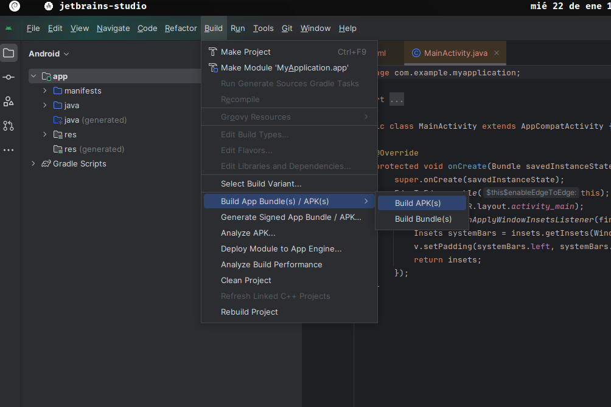

# Ejercicio 1

## Localizar el fichero .apk generado en laboratorio 00

1. Para generar el archivo .apk hay que darle en el menu hamburguesa de la esquina superior izquierda
2. Esto mostrara mas submenus entre ellos `Build`
3. Dentro de Build elegimos `Build APK(s)`

4. El archivo generado esta en `/app/build/outputs/apk/debug/app-debug.apk`

## Pasarlo al dispositivo real e instalarlo

No creo que haga falta que explique esto, ¿verdad?

## Visualizar qué recursos se han creado automáticamente en el directorio res (en la visualización Project)

### ¿Qué significan los sufijos de los directorios mipmap? ¿Qué hay en ellos?

Cada sufijo representa una densidad. Se utilizan para almacenar los iconos de la aplicación en diferentes densidades de pantalla. Android seleccionará automáticamente el icono más apropiado según la densidad de pantalla.

### ¿Qué hay en el directorio layout?

El directorio layout contiene los archivos XML que definen la interfaz de usuario de la aplicación.
